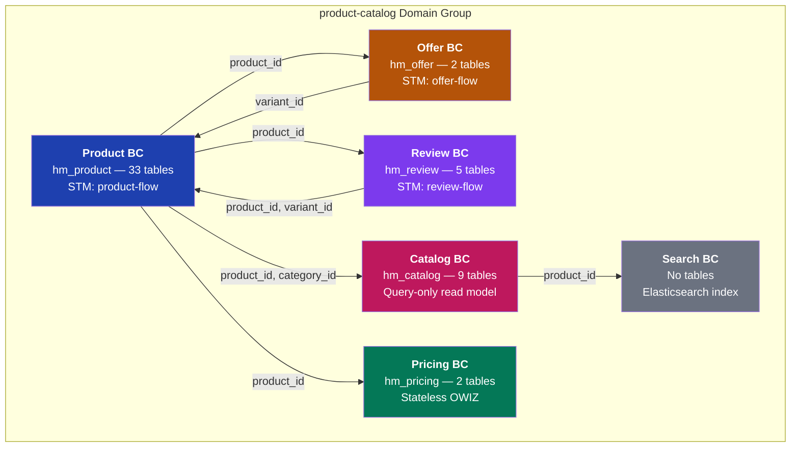

# Product-Catalog Domain Group — Complete ER Diagram

> 6 Bounded Contexts | 5 Schemas | 51 Tables | Cross-BC references via IDs (no cross-schema FKs)

---

## 1. High-Level Bounded Context Map



---

## 2. Full ER Diagram — All 51 Tables by Bounded Context

```mermaid
erDiagram

    %% ================================================================
    %% BOUNDED CONTEXT: PRODUCT (hm_product) — 33 tables
    %% ================================================================

    products {
        VARCHAR_255 id PK
        VARCHAR_100 flow_id "STM"
        VARCHAR_100 state_id "STM"
        VARCHAR_255 name
        VARCHAR_1000 description
        VARCHAR_255 brand
        VARCHAR_255 category_id FK
        VARCHAR_500 short_description
        VARCHAR_300 slug UK
        VARCHAR_200 meta_title
        VARCHAR_500 meta_description
        INT weight_grams
        TEXT dimensions_json
        VARCHAR_20 hsn_code
        VARCHAR_100 country_of_origin
        INT warranty_months
        BOOLEAN is_returnable
        INT return_window_days
        DECIMAL_12_2 base_price
        VARCHAR_100 tax_category
        BOOLEAN is_active
        VARCHAR_255 supplier_id "x-ref user BC"
        VARCHAR_255 attribute_set_id FK
        VARCHAR_30 product_type
        BOOLEAN has_options
        BOOLEAN required_options
        VARCHAR_30 visibility
        BIGINT version
        VARCHAR_50 tenant
    }

    categories {
        VARCHAR_255 id PK
        VARCHAR_255 name
        VARCHAR_255 slug UK
        VARCHAR_255 parent_id FK "self-ref"
        VARCHAR_255 path
        INT depth
        INT display_order
        BOOLEAN active
        VARCHAR_2000 description
        VARCHAR_500 image_url
        VARCHAR_200 meta_title
        VARCHAR_500 meta_description
        VARCHAR_500 meta_keywords
        BOOLEAN include_in_menu
        BOOLEAN is_anchor
        VARCHAR_255 default_attribute_set_id FK
        INT product_count
        VARCHAR_50 tenant
    }

    product_variants {
        VARCHAR_255 id PK
        VARCHAR_255 product_id FK
        VARCHAR_255 sku UK
        DECIMAL_19_2 price
        DECIMAL_19_2 special_price
        TIMESTAMP special_from_date
        TIMESTAMP special_to_date
        DECIMAL_19_2 cost
        INT weight_grams
        VARCHAR_20 status
        VARCHAR_30 visibility
        VARCHAR_255 tax_class_id
        BOOLEAN manage_stock
        INT stock_qty
    }

    attribute_definitions {
        VARCHAR_255 id PK
        VARCHAR_255 code UK
        VARCHAR_255 label
        VARCHAR_50 input_type
        BOOLEAN filterable
        BOOLEAN searchable
        BOOLEAN required
        INT display_order
        VARCHAR_20 backend_type
        VARCHAR_100 validation_class
        TEXT default_value
        BOOLEAN is_unique
        VARCHAR_500 note
        SMALLINT scope
        BOOLEAN is_visible
        BOOLEAN is_comparable
        BOOLEAN is_visible_on_front
        BOOLEAN is_html_allowed_on_front
        BOOLEAN is_used_for_price_rules
        BOOLEAN is_used_for_promo_rules
        VARCHAR_500 apply_to
        BOOLEAN is_user_defined
        BOOLEAN used_in_product_listing
        BOOLEAN used_for_sort_by
    }

    attribute_options {
        VARCHAR_255 id PK
        VARCHAR_255 attribute_id FK
        VARCHAR_255 value
        VARCHAR_255 label
        VARCHAR_255 color_swatch
        INT sort_order
        BOOLEAN is_default
        VARCHAR_20 swatch_type
    }

    attribute_groups {
        VARCHAR_255 id PK
        VARCHAR_100 code UK
        VARCHAR_255 name
        INT sort_order
        VARCHAR_100 tab_group_code
        VARCHAR_50 tenant
    }

    attribute_sets {
        VARCHAR_255 id PK
        VARCHAR_255 name
        INT sort_order
        VARCHAR_50 tenant
        TIMESTAMP created_time
        TIMESTAMP last_modified_time
        VARCHAR_100 created_by
        VARCHAR_100 last_modified_by
    }

    attribute_set_groups {
        VARCHAR_255 id PK
        VARCHAR_255 attribute_set_id FK
        VARCHAR_255 attribute_group_id FK
        INT sort_order
    }

    attribute_set_attributes {
        VARCHAR_255 id PK
        VARCHAR_255 attribute_set_id FK
        VARCHAR_255 attribute_group_id FK
        VARCHAR_255 attribute_id FK
        INT sort_order
    }

    product_attribute_values {
        VARCHAR_255 id PK
        VARCHAR_255 product_id FK
        VARCHAR_255 attribute_id FK
        VARCHAR_255 option_id FK
        VARCHAR_255 raw_value
        VARCHAR_255 value_varchar
        INT value_int
        DECIMAL_20_6 value_decimal
        TEXT value_text
        TIMESTAMP value_datetime
        VARCHAR_50 store_id
        INT sort_order
    }

    variant_attribute_values {
        VARCHAR_255 id PK
        VARCHAR_255 variant_id FK
        VARCHAR_255 attribute_id FK
        VARCHAR_255 option_id FK
        VARCHAR_255 value_varchar
        INT value_int
        DECIMAL_20_6 value_decimal
    }

    variant_attributes {
        VARCHAR_255 variant_id FK
        VARCHAR_255 attribute_key
        VARCHAR_255 attribute_value
    }

    media_assets {
        VARCHAR_255 id PK
        VARCHAR_1000 original_url
        VARCHAR_1000 cdn_url
        VARCHAR_1000 thumbnail_url
        VARCHAR_1000 medium_url
        VARCHAR_1000 zoom_url
        VARCHAR_50 type
        VARCHAR_255 mime_type
        BIGINT file_size_bytes
        INT width
        INT height
        VARCHAR_255 alt_text
        VARCHAR_50 processing_status
    }

    product_media {
        VARCHAR_255 id PK
        VARCHAR_255 product_id FK
        VARCHAR_255 asset_id FK
        BOOLEAN is_primary
        INT sort_order
    }

    variant_media {
        VARCHAR_255 variant_id PK "FK to product_variants"
        VARCHAR_255 asset_id PK "FK to media_assets"
        BOOLEAN is_primary
        INT sort_order
    }

    product_tags {
        VARCHAR_255 product_id FK
        VARCHAR_255 tag
    }

    brands {
        VARCHAR_255 id PK
        VARCHAR_255 name
        VARCHAR_255 slug UK
        VARCHAR_500 logo_url
        VARCHAR_1000 description
        VARCHAR_500 website
        BOOLEAN active
        BIGINT version
        VARCHAR_50 tenant
    }

    product_specifications {
        VARCHAR_255 id PK
        VARCHAR_255 product_id FK
        VARCHAR_100 spec_group
        VARCHAR_255 spec_key
        VARCHAR_500 spec_value
        INT display_order
    }

    product_questions {
        VARCHAR_255 id PK
        VARCHAR_255 product_id FK
        VARCHAR_255 customer_id "x-ref user BC"
        VARCHAR_2000 question
        VARCHAR_2000 answer
        VARCHAR_255 answered_by
        TIMESTAMP answered_at
        INT helpful_count
        BOOLEAN active
    }

    product_activity_log {
        VARCHAR_255 id PK
        VARCHAR_255 product_id FK
        VARCHAR_255 activity_name
        VARCHAR_2000 activity_comment
        BOOLEAN activity_success
    }

    product_relationship_types {
        VARCHAR_255 id PK
        VARCHAR_50 code UK
        VARCHAR_100 label
    }

    product_relationships {
        VARCHAR_255 id PK
        VARCHAR_255 product_id FK
        VARCHAR_255 linked_product_id FK
        VARCHAR_255 relationship_type_id FK
        INT sort_order
    }

    product_bundle_options {
        VARCHAR_255 id PK
        VARCHAR_255 product_id FK
        VARCHAR_255 title
        BOOLEAN is_required
        VARCHAR_30 type
        INT sort_order
    }

    product_bundle_selections {
        VARCHAR_255 id PK
        VARCHAR_255 bundle_option_id FK
        VARCHAR_255 product_id FK
        DECIMAL_12_4 qty
        BOOLEAN is_default
        BOOLEAN can_change_qty
        VARCHAR_10 price_type
        DECIMAL_19_2 price_value
        INT sort_order
    }

    product_custom_options {
        VARCHAR_255 id PK
        VARCHAR_255 product_id FK
        VARCHAR_255 title
        VARCHAR_30 type
        BOOLEAN is_required
        VARCHAR_64 sku
        INT max_characters
        VARCHAR_100 file_extension
        INT sort_order
        VARCHAR_10 price_type
        DECIMAL_19_2 price
    }

    product_custom_option_values {
        VARCHAR_255 id PK
        VARCHAR_255 custom_option_id FK
        VARCHAR_255 title
        VARCHAR_64 sku
        INT sort_order
        VARCHAR_10 price_type
        DECIMAL_19_2 price
    }

    category_attributes_product {
        VARCHAR_255 category_id FK
        VARCHAR_255 attribute_id FK
    }

    category_attribute_mapping {
        VARCHAR_255 id PK
        VARCHAR_255 category_id FK
        VARCHAR_255 attribute_id FK
        BOOLEAN is_required
        INT sort_order
        BOOLEAN is_filterable
    }

    attribute_definition_locales {
        VARCHAR_255 id PK
        VARCHAR_255 attribute_id FK
        VARCHAR_10 locale
        VARCHAR_255 label
    }

    attribute_option_locales {
        VARCHAR_255 id PK
        VARCHAR_255 option_id FK
        VARCHAR_10 locale
        VARCHAR_255 label
    }

    external_category_mapping {
        VARCHAR_255 id PK
        VARCHAR_255 category_id FK
        VARCHAR_50 platform
        VARCHAR_255 external_category_id
        VARCHAR_1000 external_category_path
        DECIMAL_3_2 confidence_score
        BOOLEAN is_manual
        TIMESTAMP last_synced_at
    }

    external_attribute_mapping {
        VARCHAR_255 id PK
        VARCHAR_255 attribute_id FK
        VARCHAR_50 platform
        VARCHAR_255 external_attribute_code
        VARCHAR_255 external_attribute_label
        VARCHAR_30 transform_type
        TEXT transform_config
        TIMESTAMP last_synced_at
    }

    units_of_measure {
        VARCHAR_255 id PK
        VARCHAR_20 code UK
        VARCHAR_100 name
        VARCHAR_30 unit_type
        DECIMAL_15_6 conversion_factor
        VARCHAR_20 base_unit_code
    }

    %% ================================================================
    %% BOUNDED CONTEXT: OFFER (hm_offer) — 2 tables
    %% ================================================================

    offer {
        VARCHAR_255 id PK
        VARCHAR_100 flow_id "STM"
        VARCHAR_100 state_id "STM"
        VARCHAR_255 product_id "x-ref product BC"
        VARCHAR_255 supplier_id "x-ref user BC"
        VARCHAR_255 variant_id "x-ref product BC"
        VARCHAR_255 offer_type
        VARCHAR_255 title
        VARCHAR_2000 description
        DECIMAL_19_2 original_price
        DECIMAL_19_2 offer_price
        DECIMAL_5_2 discount_percent
        TIMESTAMP start_date
        TIMESTAMP end_date
        INT max_quantity
        INT sold_quantity
        DECIMAL_3_2 seller_rating
        BOOLEAN buy_box_winner
        VARCHAR_20 fulfillment_type
        DECIMAL_10_2 shipping_cost
        INT delivery_days
        VARCHAR_255 sku
        DECIMAL_12_2 mrp
        INT stock_quantity
        INT min_order_qty
        INT max_order_qty
        VARCHAR_50 item_condition
        DECIMAL_5_2 buy_box_score
        BOOLEAN active
        VARCHAR_3 currency
        BIGINT version
        VARCHAR_50 tenant
    }

    offer_activity_log {
        VARCHAR_255 id PK
        VARCHAR_255 offer_id FK
        VARCHAR_255 event_id
        VARCHAR_255 comment
    }

    %% ================================================================
    %% BOUNDED CONTEXT: PRICING (hm_pricing) — 2 tables
    %% ================================================================

    pricing_rules {
        VARCHAR_255 id PK
        VARCHAR_255 name
        VARCHAR_50 rule_type
        INT priority
        TEXT conditions
        VARCHAR_50 discount_type
        DECIMAL_10_2 discount_value
        TIMESTAMP active_from
        TIMESTAMP active_to
        BOOLEAN active
        TEXT applicable_products "x-ref product IDs"
        TEXT applicable_categories "x-ref category IDs"
        BIGINT version
        VARCHAR_50 tenant
    }

    price_history {
        VARCHAR_255 id PK
        VARCHAR_255 product_id "x-ref product BC"
        DECIMAL_19_2 old_price
        DECIMAL_19_2 new_price
        VARCHAR_255 change_reason
        VARCHAR_100 changed_by
        TIMESTAMP created_time
    }

    %% ================================================================
    %% BOUNDED CONTEXT: REVIEW (hm_review) — 5 tables
    %% ================================================================

    product_reviews {
        VARCHAR_255 id PK
        VARCHAR_100 flow_id "STM"
        VARCHAR_100 state_id "STM"
        VARCHAR_255 product_id "x-ref product BC"
        VARCHAR_255 customer_id "x-ref user BC"
        VARCHAR_255 order_id "x-ref order BC"
        VARCHAR_255 variant_id "x-ref product BC"
        INT rating
        VARCHAR_255 title
        TEXT body
        TEXT images
        BOOLEAN verified_purchase
        INT helpful_count
        INT report_count
        TEXT moderator_notes
        VARCHAR_50 review_source
        BIGINT version
        VARCHAR_50 tenant
    }

    review_activity {
        VARCHAR_255 id PK
        VARCHAR_255 review_id FK
        VARCHAR_255 activity_name
        BOOLEAN activity_success
        VARCHAR_255 activity_comment
    }

    review_images {
        VARCHAR_255 id PK
        VARCHAR_255 review_id FK
        VARCHAR_500 image_url
        VARCHAR_500 thumbnail_url
        INT sort_order
    }

    review_votes {
        VARCHAR_255 id PK
        VARCHAR_255 review_id FK
        VARCHAR_255 user_id "x-ref user BC"
        VARCHAR_20 vote_type
    }

    review_responses {
        VARCHAR_255 id PK
        VARCHAR_255 review_id FK
        VARCHAR_255 note "placeholder"
    }

    %% ================================================================
    %% BOUNDED CONTEXT: CATALOG (hm_catalog) — 9 tables
    %% ================================================================

    catalog_items {
        VARCHAR_255 id PK
        VARCHAR_50 product_id "x-ref product BC"
        VARCHAR_255 variant_id "x-ref product BC"
        VARCHAR_255 supplier_id "x-ref user BC"
        VARCHAR_255 name
        DECIMAL_19_2 price
        DECIMAL_12_2 offer_price
        DECIMAL_12_2 mrp
        DECIMAL_5_2 discount_percent
        VARCHAR_2000 description
        VARCHAR_255 brand
        VARCHAR_500 image_url
        BOOLEAN in_stock
        INT available_qty
        DECIMAL_3_2 average_rating
        INT review_count
        BOOLEAN featured
        INT display_order
        BOOLEAN active
        VARCHAR_255 category_id "x-ref product BC"
        VARCHAR_20 hsn_code
        INT weight_grams
        VARCHAR_100 country_of_origin
        BOOLEAN is_returnable
        VARCHAR_50 tenant
    }

    catalog_item_tags {
        VARCHAR_255 catalog_item_id FK
        VARCHAR_255 tag
    }

    catalog_categories {
        VARCHAR_255 id PK
        VARCHAR_100 name
        VARCHAR_100 slug UK
        VARCHAR_500 description
        VARCHAR_50 parent_id FK "self-ref"
        INT level
        INT display_order
        VARCHAR_500 image_url
        VARCHAR_100 icon
        BOOLEAN active
        BOOLEAN featured
        BIGINT product_count
        VARCHAR_100 meta_title
        VARCHAR_200 meta_description
        VARCHAR_200 meta_keywords
        VARCHAR_500 banner_image_url
        BOOLEAN show_in_menu
        BOOLEAN show_in_footer
        VARCHAR_50 tenant
    }

    category_product_mapping {
        VARCHAR_255 id PK
        VARCHAR_100 category_id FK
        VARCHAR_50 product_id "x-ref product BC"
        INT display_order
        VARCHAR_50 added_by
    }

    collections {
        VARCHAR_255 id PK
        VARCHAR_100 name
        VARCHAR_100 slug UK
        VARCHAR_500 description
        VARCHAR_20 type
        VARCHAR_500 image_url
        TIMESTAMP start_date
        TIMESTAMP end_date
        BOOLEAN active
        BOOLEAN featured
        INT display_order
        BOOLEAN auto_update
        VARCHAR_1000 rule_expression
        BIGINT product_count
        VARCHAR_50 tenant
    }

    collection_product_mapping {
        VARCHAR_255 id PK
        VARCHAR_50 collection_id FK
        VARCHAR_50 product_id "x-ref product BC"
        INT display_order
        VARCHAR_50 added_by
    }

    category_rules {
        VARCHAR_255 id PK
        VARCHAR_255 category_id FK "unique"
        DECIMAL_5_2 commission_rate
        DECIMAL_5_2 gst_rate
        VARCHAR_8 hsn_code
        INT return_days
        VARCHAR_20 return_type
        DECIMAL_6_2 max_weight_kg
        VARCHAR_20 shipping_type
        VARCHAR_20 restriction_type
        VARCHAR_100 required_license
        INT min_images
        INT min_description_length
        BOOLEAN ean_required
        VARCHAR_50 tenant
    }

    category_attributes_catalog {
        VARCHAR_255 id PK
        VARCHAR_255 category_id FK
        VARCHAR_100 attribute_name
        VARCHAR_20 attribute_type
        BOOLEAN is_required
        TEXT allowed_values
        INT sort_order
        VARCHAR_50 tenant
    }

    hsn_gst_mapping {
        VARCHAR_8 hsn_chapter PK
        VARCHAR_255 description
        DECIMAL_5_2 gst_rate
        DECIMAL_5_2 cgst_rate
        DECIMAL_5_2 sgst_rate
        DECIMAL_5_2 igst_rate
    }

    %% ================================================================
    %% RELATIONSHIPS WITHIN PRODUCT BC
    %% ================================================================

    products ||--o{ product_variants : "has variants"
    products ||--o{ product_tags : "tagged"
    products ||--o{ product_media : "has media"
    products ||--o{ product_attribute_values : "attr values"
    products ||--o{ product_activity_log : "audit"
    products ||--o{ product_specifications : "specs"
    products ||--o{ product_questions : "Q&A"
    products ||--o{ product_relationships : "source link"
    products ||--o{ product_bundle_options : "bundle slots"
    products ||--o{ product_bundle_selections : "in bundles"
    products ||--o{ product_custom_options : "custom opts"
    products }o--|| categories : "in category"
    products }o--o| attribute_sets : "uses set"

    product_variants ||--o{ variant_attributes : "key-value"
    product_variants ||--o{ variant_media : "media"
    product_variants ||--o{ variant_attribute_values : "typed values"

    product_media }o--|| media_assets : "asset"
    variant_media }o--|| media_assets : "asset"

    attribute_definitions ||--o{ attribute_options : "options"
    attribute_definitions ||--o{ attribute_definition_locales : "i18n"
    attribute_definitions ||--o{ product_attribute_values : "product vals"
    attribute_definitions ||--o{ variant_attribute_values : "variant vals"
    attribute_definitions ||--o{ attribute_set_attributes : "in sets"
    attribute_definitions ||--o{ category_attribute_mapping : "per category"
    attribute_definitions ||--o{ category_attributes_product : "legacy"
    attribute_definitions ||--o{ external_attribute_mapping : "ext mapping"

    attribute_options ||--o{ attribute_option_locales : "i18n"

    attribute_sets ||--o{ attribute_set_groups : "has groups"
    attribute_sets ||--o{ attribute_set_attributes : "has attrs"
    attribute_groups ||--o{ attribute_set_groups : "in sets"
    attribute_groups ||--o{ attribute_set_attributes : "groups attrs"

    categories ||--o{ category_attributes_product : "legacy attrs"
    categories ||--o{ category_attribute_mapping : "attrs"
    categories ||--o{ external_category_mapping : "ext mapping"
    categories o|--o| categories : "parent-child"

    product_relationship_types ||--o{ product_relationships : "type"
    product_bundle_options ||--o{ product_bundle_selections : "selections"
    product_custom_options ||--o{ product_custom_option_values : "values"

    %% ================================================================
    %% RELATIONSHIPS WITHIN OFFER BC
    %% ================================================================

    offer ||--o{ offer_activity_log : "audit"

    %% ================================================================
    %% RELATIONSHIPS WITHIN REVIEW BC
    %% ================================================================

    product_reviews ||--o{ review_activity : "audit"
    product_reviews ||--o{ review_images : "images"
    product_reviews ||--o{ review_votes : "votes"
    product_reviews ||--o{ review_responses : "responses"

    %% ================================================================
    %% RELATIONSHIPS WITHIN CATALOG BC
    %% ================================================================

    catalog_items ||--o{ catalog_item_tags : "tags"
    catalog_categories ||--o{ category_product_mapping : "products"
    catalog_categories ||--o{ category_rules : "rules"
    catalog_categories ||--o{ category_attributes_catalog : "attrs"
    catalog_categories o|--o| catalog_categories : "parent-child"
    collections ||--o{ collection_product_mapping : "products"

    %% ================================================================
    %% CROSS-BC REFERENCES (by ID, no physical FK)
    %% ================================================================

    products ||--o{ offer : "x-ref product_id"
    products ||--o{ price_history : "x-ref product_id"
    products ||--o{ product_reviews : "x-ref product_id"
    products ||--o{ catalog_items : "x-ref product_id"
    product_variants ||--o{ offer : "x-ref variant_id"
```

---

## 3. Cross-BC Reference Summary

No physical foreign keys exist between schemas — all cross-BC references are **logical** (same ID, different schema).

| From Table (Schema) | Column | References (Schema) | Purpose |
|---------------------|--------|---------------------|---------|
| **offer** (hm_offer) | product_id | products (hm_product) | Which product this offer is for |
| **offer** (hm_offer) | variant_id | product_variants (hm_product) | Specific variant being offered |
| **offer** (hm_offer) | supplier_id | supplier (hm_user) | Who is selling |
| **price_history** (hm_pricing) | product_id | products (hm_product) | Price change tracking |
| **pricing_rules** (hm_pricing) | applicable_products | products (hm_product) | JSON list of product IDs |
| **pricing_rules** (hm_pricing) | applicable_categories | categories (hm_product) | JSON list of category IDs |
| **product_reviews** (hm_review) | product_id | products (hm_product) | Reviewed product |
| **product_reviews** (hm_review) | variant_id | product_variants (hm_product) | Reviewed variant |
| **product_reviews** (hm_review) | customer_id | user_profiles (hm_user) | Reviewer |
| **product_reviews** (hm_review) | order_id | orders (hm_order) | Verified purchase |
| **review_votes** (hm_review) | user_id | user_profiles (hm_user) | Who voted |
| **catalog_items** (hm_catalog) | product_id | products (hm_product) | Denormalized product data |
| **catalog_items** (hm_catalog) | variant_id | product_variants (hm_product) | Denormalized variant data |
| **catalog_items** (hm_catalog) | supplier_id | supplier (hm_user) | Denormalized seller |
| **category_product_mapping** (hm_catalog) | product_id | products (hm_product) | Category listing |
| **collection_product_mapping** (hm_catalog) | product_id | products (hm_product) | Collection listing |
| **product_questions** (hm_product) | customer_id | user_profiles (hm_user) | Who asked |
| **products** (hm_product) | supplier_id | supplier (hm_user) | Product owner/seller |

---

## 4. Table Count by Bounded Context

| BC | Schema | Tables | STM? | Role |
|----|--------|--------|------|------|
| **Product** | hm_product | 33 | Yes (product-flow) | Source of truth: products, variants, attributes, categories, media |
| **Offer** | hm_offer | 2 | Yes (offer-flow) | Seller pricing/availability per product |
| **Pricing** | hm_pricing | 2 | No (stateless OWIZ) | Pricing rules engine + price history |
| **Review** | hm_review | 5 | Yes (review-flow) | Customer reviews with moderation workflow |
| **Catalog** | hm_catalog | 9 | No (query-only) | Denormalized read model for storefront |
| **Search** | — | 0 | No | Elasticsearch index (no SQL tables) |
| **Total** | | **51** | | |
